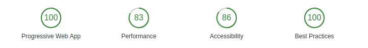

## Evaluierung von PWAs  


<h1> https://schubi-pwa.firebaseapp.com/ </h1>




```bash
PWA "https://developers.google.com/web/progressive-web-apps/"
```

## Table of Contents

  - [Grundlage](#grundlage)
  - [Polymer](#polymer)
  - [Firebase](#firebase)
  - [Android Devices](#android-devices)
  - [iOS Devices](#ios-devices)
  - [Konsole für Android Browser](#konsole-für-android-browser)
  - [Offlinefähigkeit](#offlinefähigkeit)
  - [Bilder Offline Speichern](#bilder-offline-speichern)
  - [Offline Notizen](#offline-notizen)
  - [Pluralsight](#pluralsight)
  - [Handbuch](#handbuch)
  - [Nativefier](#nativefier)
  - [TODO](#todo)
  
  
## Grundlage

Als Grundlage für das gesamte Projekt wird ein Beispiel aus den Code Labs von Google benutzt.
Und zwar das Projekt: 
Your First Progressive Web App
- https://developers.google.com/web/fundamentals/codelabs/your-first-pwapp/ <br/>
Nach der Erstellung der App und die Einarbeitung in HTML5 und JavaScript wurde mit der ausgiebigeren Recherche zum Thema Progressive Web Apps begonnen. <br/>

### Usefull links:
Instant Loading: Building offline-first Progressive Web Apps - Google I/O 2016 <br>
!!! https://www.youtube.com/watch?v=cmGr0RszHc8 !!! <br/>

Intro to Progressive Web Apps - von Google <br/>
https://de.udacity.com/course/intro-to-progressive-web-apps--ud811 :) <br/>

## Polymer
```bash
Polymer is an open-source JavaScript library for building web applications using Web Components.
```
Gestart wird mit diesem Porjekt:
- https://www.polymer-project.org/2.0/start/quick-tour

Im Anschluss wurden diese Funktionen in das bestehende Projekt mit eingebunden.
- https://auth0.com/blog/build-your-first-app-with-polymer-and-web-components/


## Firebase
- https://console.firebase.google.com <br/>

```bash
Firebase gives you the tools to develop high-quality apps, grow your user base, and earn more money. We cover the essentials so you can monetize your business and focus on your users.
```
<br/>
Firebase zur Web Applikation hinzufügen: 

- https://firebase.google.com/docs/web/setup
  
## Android Devices


Zur Evaluierung wird das Programm Genymotion verwendet:
- https://www.genymotion.com/
- Ein Android Emulator mit dem man verschiedene Devices emulieren kann
- Ebenfalls können die passenden Android Gapps für jedes Gerät einfach installiert werden
-  Ich lege als standard Gerät das Samsung Galaxy S3 fest
- Bei der Verwendung des Programms sind jedoch nach einiger Zeit vermehrt Fehlermeldungen aufgetreten. Oftmals hat sich das ganze Programm auf gehangen und teilweise ist der gesamte Rechner abgestürzt. Deshalb musste ich mich nach einer Alternative umsehen.

Eine Alternative zu Genymotion ist Android-Studio:
- (Installationsguide für Ubuntu: https://developer.android.com/studio/install.html)
- (Starter Angelegen: https://askubuntu.com/questions/141229/how-to-add-a-shell-script-to-launcher-as-shortcut )

Das oben genannte Standardgerät muss als neues virtuelles Gerät angelegt werden:
- https://stackoverflow.com/questions/10833402/android-avd-settings-for-galaxy-s3-like-avd
Bei manchen Geräten ist der PlayStore mit dabei!
- Emulator mit Cold Boot starten! (Rechtsklick bei der Auswahl) sonst bleibt der Display schwarz
- Es muss noch ein Weg gefunden werden die Gapps auch bei anderen Devices zu installieren
- Download von Apps erfolgt von dieser Seite: 
- https://www.apkmirror.com/
→ http://www.giga.de/apps/android/specials/apk-mirror-serioeser-download-von-android-apps/

### [Ergebnis Android](Android)
Bei bisher allen getesteten Browsern war es möglich die Offlinefähigkeit zu nutzen, sowie ein Shortcut für den Homescreen zu erstellen.</br>
//Da die eigens entwickelte PWA noch nicht über HTTPS verfügbar ist wurde derweil www.pokedex.org verwendet.


## iOS Devices:

 <br/>
- http://www.businessinsider.de/the-iphone-x-has-a-higher-adoption-rate-than-the-iphone-8-and-iphone-8-plus-2017-12?r=UK&IR=T


```bash
Ob das Verfahren funktioniert muss erst getestet werden
"http://www.anexinet.com/blog/install-app-ios-simulator/"
```
Hier wird erklärt, wie man Apps in xCode-Emulatoren installieren kann. <br/>
Das ist wichtig, da der AppStore nicht installiert ist und man nur so die Möglichkeit bekommt
eine PWA mit sämtlichen Browsern zu testen.<br/>
Eventuell auch nächster [Schrit](#konsole-für-android-browser) realisierbar??? <br/>
Seit einem neuen Update von iTunes auf die Version 12.7 ist es nicht mehr möglich Apps aus dem iTunes Store zu beziehen. Deshalb musste man zuerst auf eine ältere Version downgraden. <br/>
- http://www.computerbild.de/artikel/cb-News-Software-Downgrade-iTunes-12.6.3-bringt-den-App-Store-zurueck-19146571.html
- https://support.apple.com/en-gb/HT208079


### Problem

Die Apps lassen sich wie oben im Link beschrieben installieren, jedoch starten die Anwedungen nur ganz kurz und stürzen dann wieder ab. 

```bash
APPLE:
Note: You cannot install apps from the App Store in simulation environments.
```
- https://developer.apple.com/library/content/documentation/IDEs/Conceptual/iOS_Simulator_Guide/InteractingwiththeiOSSimulator/InteractingwiththeiOSSimulator.html#//apple_ref/doc/uid/TP40012848-CH3-SW8
- https://forums.developer.apple.com/thread/20257

```bash
Zitat Glyn Williams:
The iOS simulator is a version of iOS running in x86 (Intel) machine language.  Apps on the app store are ARM code.
```
- https://www.quora.com/Is-it-possible-to-install-iOS-apps-to-Xcode-built-in-iOS-simulator


### Lösung


Um trotzdem zu einem Ergbnis zu kommen wird im folgenden ein Orginalgerät verwendet!
```bash
folgt
```

 <br/>


Mit den iOS Versionen 10 und 11 sind 93% des Marktes abgedeckt, weshalb sich auf diese konzentriert werden soll!

Ünterstützte Geräte: <br/>
 <br/>
- http://www.iphone-magazin.eu/ios-10-diese-geraete-bekommen-das-update/
- https://www.stern.de/digital/smartphones/ios-11--fuer-diese-apple-geraete-kommt-das-neue-system-7482156.html


-> Bis iOS 6.1.6 ist es zwar möglich ein Shortcut auf dem Homescreen zu erstellen, es kann jedoch nicht die API IndexedDB verwendet werden. !!Fehlende Unterstützung (Gerät zu Alt)!!
Um neuere iOS Versionen zu testen muss ein neues Gerät angeschafft werden.


### [Ergebnis iOS](iOS)
Bei der Evaluierung mit dem Apple eigenen Browser Safari waren alle Funktionen verfügbar.</br>
- https://developer.apple.com/library/content/releasenotes/General/WhatsNewInSafari/Articles/Safari_10_0.html 

Durch ein etwas komplexeres Verfahren war es schlussendlich auch möglich verschiedene Versionen von Firefox auf dem Gerät zu installieren. <br/>
- https://github.com/mozilla-mobile/firefox-ios <br/>
Man jedoch bei keiner die Möglichkeit ein Shortcut zum Startbildschirm hinzuzufügen. <br/>

//Da die eigens entwickelte PWA noch nicht über HTTPS verfügbar ist wurde derweil www.pokedex.org verwendet.


## Konsole für Android Browser

Um eine Konsole für einen Android Browser zu erhalten wird die Möglichkeit von Google Chrome, das Remote-Debugging, verwendet. 
- https://developers.google.com/web/tools/chrome-devtools/remote-debugging/?utm_source=dcc&utm_medium=redirect&utm_campaign=2016q3 <br/>
Um dies zu nutzen sind folgende Schritte notwendig:

1. Im Emulator den DeveloperModus Aktivieren 
	( 8x in den Einstellungen auf Build-Number drücken)
2. USB-Debugging in den Developer-Options Aktivieren 
3. GoogleChrome für das Android Gerät herunterladen und installieren
4. GoogleChrome am Rechner Starten
5. -> In den Entwicklertools den Punkt "remote devices" öffnen 
6. Nun besteht die Möglichkeit die Konsole vom Android Gerät am Rechner abzulesen

## Offlinefähigkeit

Der wichtigste Punkt bei solchen Anwendungen ist die Offlinefähigkeit.
Ein weiterer Schritt war nun die maximalen Speichergrenzen zu finden.
Eine Übersicht dieser und eine Möglichkeit sie für jedes Gerät und jeden Browser individuell zu testen findet man unter:
- https://www.html5rocks.com/en/tutorials/offline/quota-research/

 <br/>

- https://developers.google.com/web/fundamentals/instant-and-offline/web-storage/offline-for-pwa


Nun wurde das fertige Projekt von Google dazu verwendet, um weitere API's mit einer solchen Progressive Web App zu testen.

Das erste Vorhaben war es, eine Möglichkeit für den Nutzer zu Programmieren, die es ermöglicht Bilder aufzunehmen und diese Offline zu Speichern.
Dafür wurde zu Beginn die selbe API benutzt, die auch die Entwickler von Google für Ihre Weather App nutzten: LocalForage.
- https://localforage.github.io/localForage/
Dies erwies sich auch an allen Rechnern als Erfolg.
Bei der Evaluierung für Android Geräte stellte sich jedoch heraus, dass diese API für das Vorhaben bei mobilen Browsern nicht geeignet ist.

## Bilder Offline Speichern

Daraufhin musste auf eine andere zurückgegriffen werden. Nämlich IndexedDB:
- https://developer.mozilla.org/de/docs/IndexedDB <br/>

 <br/> 
- https://caniuse.com/#feat=indexeddb


Ein Beispiel für ein ähnliches Vorhaben zeigt Robert Nyman:
- https://hacks.mozilla.org/2012/02/storing-images-and-files-in-indexeddb/
		
Um ein Bild einzufügen und vor dem Speicher als Thumbnail zu sehen wurde der Code der zweiten Antwort auf dieser Seite verwendet:
- https://stackoverflow.com/questions/4459379/preview-an-image-before-it-is-uploaded/40881315

Durch viel Ausprobieren und Codeveränderung ist es nun möglich, Bilder sowohl an Desktop Rechnern, sowie an Android Geräten aufzunehmen und offline zu Speichern.

## Offline Notizen

Im Anschluss kam die Frage auf was eine Progressive Web App noch alles können sollte.
Besonders zum Thema offline Fähigkeit kam mir die Idee eine Möglichkeit einzubinden, Notizen offline zu Speichern und bei Bedarf anzusehen und zu löschen.

Ein solches Projekt gab es schon, wodurch es mir möglich war den Code größtenteils einfach zu kopieren.:


- http://blog.teamtreehouse.com/create-your-own-to-do-app-with-html5-and-indexeddb
### Neuer Code
Bilder Hinzufügen und Speichern // Filereader:

- https://stackoverflow.com/questions/3814231/loading-an-image-to-a-img-from-input-file

Datum wann die Notiz hinzugefügt wurde:

- http://jsfiddle.net/joya/o22s96ne/

### zum Thema @param

- http://usejsdoc.org/tags-param.html


## Pluralsight 

Creating Offline-first Mobile Apps with HTML5:
Grobe Anleitung zum Erstellen einer Web App anhand eines Beispiels.
- https://www.pluralsight.com/ 
- https://github.com/phiratio/Pluralsight-materials/tree/master/Individual%20course%20series/Creating%20Offline-first%20Mobile%20Apps%20with%20HTML5


## Handbuch
Handbuch zum Testen von Web- und Mobilen-Apps <br/>
Eventuell neue Möglichkeiten zur Evaluierung? IOS-Devices??
- https://link.springer.com/book/10.1007/978-3-662-44028-5

## Nativefier 

Dadurch hat man nun die Möglichkeit eine WebApp für Desktop-Rechner zu erstellen. Hierbei spielt es keine Rolle welcher Browser installiert ist.
Bei GoogleChrome besteht die Möglichkeit, ein App-Shortcut am Desktop anzulegen und dieses zu nutzen. Bei Firefox sucht man diese Funktion leider noch vergebens.  
- https://github.com/jiahaog/nativefier <br/><br/>


## TODO
Möglichkeit von Push-Nachrichten:
- https://developers.google.com/web/fundamentals/codelabs/push-notifications/
<br/>
todo branch -> timestampt als objectStore von "MasterSav()"


### New Code
Input von mehreren Bilder und Vorschau vor dem Upload
- http://jsfiddle.net/0GiS0/Yvgc2/

HTML5 Accelerometer (JS window.DeviceMotionEvent API)
- https://codepen.io/lehollandaisvolant/pen/prgZyB <br/>
<br/>

Es ist jetzt möglich beliebig viele Bilder Offline zu Speichern und anschließend wiederzugeben <br/>


[Zum Anfang↑](#evaluierung-von-pwas)

